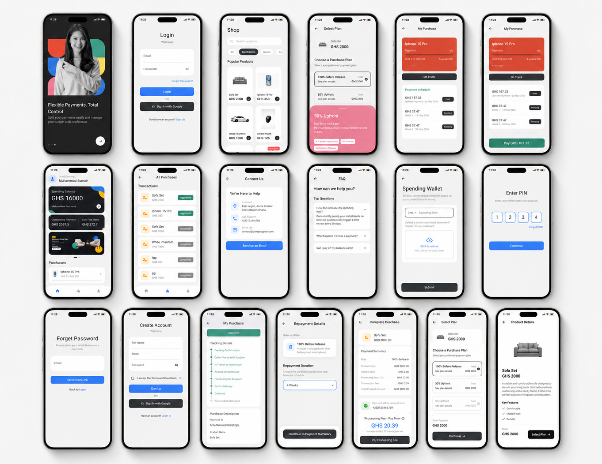

  

  <h1 style="color:#2E8B57; font-size:36px; margin-bottom:8px;">
    Buye
  </h1>

  <h3 style="color:#333333; margin-top:0; font-weight:500;">
    Buy Now, Pay Later Mobile Application
  </h3>

  

    BUYE is a mobile-first financial technology application designed for African consumers, with an initial focus on Ghana. It enables users to purchase products immediately and repay through flexible installment plans, making shopping more accessible, secure, and manageable.
  

 

  <h2 style="color:#2E8B57; margin-top:0;">
    Project Overview
  </h2>

  

    BUYE bridges the gap between consumer purchasing power and access to affordable credit. The application allows users to browse products, select a repayment plan, complete purchases securely, track outstanding payments, and manage their spending through a clean mobile dashboard.
  

  

    The app is built with a strong focus on financial accessibility, identity verification, real-time updates, and secure transaction handling using Firebase-powered infrastructure.
  

 

<h2 style="font-family: Arial, sans-serif; color:#333333;">
  Core Features
</h2>

<table style="width:100%; border-collapse:collapse; font-family:Arial, sans-serif;">

  <tr style="border-bottom:1px solid #eeeeee;">
    <td style="padding:14px;">
      <h3 style="margin:0; color:#2E8B57;">
        Flexible Installment Plans
      </h3>
      

        Users can purchase products and repay through flexible durations such as 7, 14, 21, and 30 days to maximum of 24 weeks. Each plan displays installment amounts, service charges, total payable amount, and repayment schedule before confirmation.
      

    </td>
  </tr>

  <tr style="border-bottom:1px solid #eeeeee;">
    <td style="padding:14px;">
      <h3 style="margin:0; color:#2E8B57;">
        Product Discovery & Shopping
      </h3>
      

        Users can browse a product catalog, view detailed product information, check availability, explore featured items, and complete purchases through a smooth mobile shopping flow.
      

    </td>
  </tr>

  <tr style="border-bottom:1px solid #eeeeee;">
    <td style="padding:14px;">
      <h3 style="margin:0; color:#2E8B57;">
        Secure Authentication
      </h3>
      

        BUYE supports email/password login, Google Sign-In, password recovery, session management, and PIN-based transaction security for safer user access and payment confirmation.
      

    </td>
  </tr>

  <tr style="border-bottom:1px solid #eeeeee;">
    <td style="padding:14px;">
      <h3 style="margin:0; color:#2E8B57;">
        KYC Verification
      </h3>
      

        The app includes identity verification through government ID upload, biometric/selfie capture, address proof submission, and real-time verification status tracking.
      

    </td>
  </tr>

  <tr style="border-bottom:1px solid #eeeeee;">
    <td style="padding:14px;">
      <h3 style="margin:0; color:#2E8B57;">
        Spending Wallet & Payment Tracking
      </h3>
      

        Users can view available spending balance, outstanding payments, recent purchases, installment schedules, payment status, and complete purchase history from their dashboard.
      

    </td>
  </tr>

  <tr>
    <td style="padding:14px;">
      <h3 style="margin:0; color:#2E8B57;">
        Notifications & Analytics
      </h3>
      

        BUYE provides push notifications, in-app alerts, payment reminders, purchase confirmations, delivery updates, and spending analytics to help users stay informed.
      

    </td>
  </tr>

</table>

 

  <h2 style="color:#333333; margin-top:0;">
    Technology Stack
  </h2>

  

    The application is developed using Flutter and Dart for cross-platform mobile development, with Firebase services powering authentication, database operations, cloud storage, real-time updates, messaging, and analytics.
  

  

    <code style="background-color:#e8f5e9; color:#1b5e20; padding:5px 9px; border-radius:5px;">Flutter</code>
    <code style="background-color:#e8f5e9; color:#1b5e20; padding:5px 9px; border-radius:5px;">Dart</code>
    <code style="background-color:#e3f2fd; color:#0d47a1; padding:5px 9px; border-radius:5px;">Firebase Auth</code>
    <code style="background-color:#e3f2fd; color:#0d47a1; padding:5px 9px; border-radius:5px;">Cloud Firestore</code>
    <code style="background-color:#e3f2fd; color:#0d47a1; padding:5px 9px; border-radius:5px;">Realtime Database</code>
    <code style="background-color:#fff3e0; color:#e65100; padding:5px 9px; border-radius:5px;">Firebase Storage</code>
    <code style="background-color:#fff3e0; color:#e65100; padding:5px 9px; border-radius:5px;">Firebase Cloud Messaging</code>
  

  <h2 style="color:#333333; margin-top:0;">
    Purpose
  </h2>

  

    BUYE aims to make quality products more accessible by giving users a secure, flexible, and transparent way to shop now and pay later. The platform is designed for scalability across Ghana and future expansion into other African markets.
  

